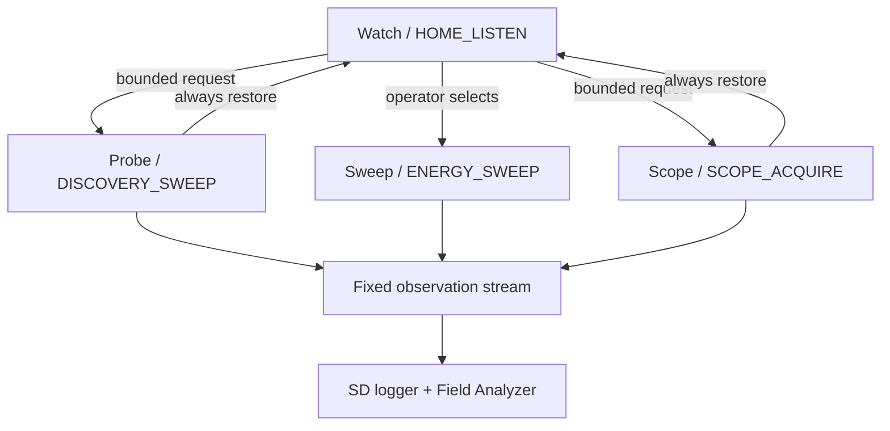

# LoRaTrace RX — Phase 7 Alignment and Phases 8–10 Design

**Status:** Accepted design direction; Phase 10's v1.0 promotion gate remains a later explicit decision

**Date:** 2026-08-26

**Baseline:** LoRaTrace RX v0.6.8, repository commit `0bbe314`

**Target hardware:** M5Stack Cardputer-Adv + Cap LoRa-1262 (SX1262 + GNSS, no PSRAM)

## 1. Decision summary

The synced repository inserts device optimization as Phase 7. Discovery and Energy Sweep therefore move to Phases 8 and 9, while the selected Field Analyzer concept becomes planned Phase 10. The sequence should extend LoRaTrace as a passive field instrument, not turn it into a Meshtastic client.

| Phase | Release | Operator label | Outcome |
|---|---:|---|---|
| 7 | v0.7.x | **Device optimization** | Finish the repository's measured heap, fragmentation, task-stack, WiFi-lifecycle, combined-load, and soak gates before adding scan states. |
| 8 | v0.8.x | **Probe** | A bounded CAD sweep finds likely activity on curated alternate LoRa channels, then restores the home listener. |
| 9 | v0.9.x | **Sweep** | A real frequency-binned RSSI sweep maps energy across the usable 868–923 MHz front end and selectively checks likely LoRa activity. |
| 10 | v1.0.x (proposed) | **Field Analyzer** | Meter, true waterfall, time scope, recent captures, and a passive node roster visualize data already acquired by Watch, Probe, and Sweep. |

The repository currently defines `v1.0.x` as all four profiles and their UI being stable after Phase 9. Phase 10 is now accepted as planned scope, but whether it becomes the `v1.0.x` promotion gate remains an explicit product decision after Phase 9 establishes its real memory and field behavior. If accepted then, the mapping fits the project's existing rule that `MAJOR.MINOR` tracks the build-order phase.

The useful lesson from Poseidon is the shape of the operator experience and several failure modes—not its implementation. LoRaTrace will use its own state machines, records, UI, and tests, based on Semtech, RadioLib, M5Stack, and Meshtastic primary sources.

### 1.1 Repository reconciliation

The earlier draft used commit `cb7aed3`. Current `main` at `0bbe314` materially changes the plan:

- Phase 7 is now a dedicated device-optimization epic; `DISCOVERY_SWEEP` and `ENERGY_SWEEP` moved to Phases 8 and 9 without changing their RF scope.
- `memory_stats.h/.cpp` now records internal largest-free-block, free/allocated block counts, and stack high-water marks for all five tasks.
- `session.csv` already appends `heap_largest`, heap block counts, and radio/GPS/logger/UI/WiFi stack minima.
- `HARDWARE_TESTING.md` now defines the canonical boot, receive, WiFi-cycle, browser, combined-load, and two-hour-soak matrix.
- Partial run0065 measured 233,952 B free with WiFi off and exposed a 716 B/13-allocation loss on the second AP cycle. Route registration was made idempotent; the required fixed-build ten-cycle retest remains open.
- The provisional stack reductions total 3,328 B, but none is approved until the missing workloads and one-at-a-time retests pass.
- The built-in LongFast tuple still contains CR 4/8, so the independent CR 4/5 correctness concern remains open.

## 2. Permanent product boundaries

These constraints apply to every phase:

1. **Receive only.** No beacon, chat, direct message, position broadcast, injection, or other RF transmission.
2. **Metadata first.** Do not decrypt application payloads, show payload bytes, or advertise a protocol decoder. Meshtastic header metadata already available in cleartext may still be classified.
3. **One radio owner.** Only the Core 1 radio task may configure or poll the SX1262. UI, logger, GPS, and WiFi code consume snapshots or queued records.
4. **Bounded memory.** Use fixed-size arrays, queues, and reusable formatting buffers. No allocation in ISR, radio acquisition, or draw loops.
5. **SD is the datastore.** RAM contains only bounded queues, current aggregates, and short display history. The web UI streams files or bounded snapshots; it does not cache entire logs.
6. **Truthful visualizations.** Frequency is shown on an axis only when separate frequency bins were actually measured. A time series at one tuned frequency must be called a scope, not a spectrum or waterfall.
7. **Operator-selected modes.** LoRaTrace does not silently change mission profile or claim that an unknown LoRa signal belongs to a particular network.
8. **Hardware claims require hardware evidence.** Host tests establish deterministic logic; real Cardputer-Adv + Cap LoRa-1262 runs establish timing, RF behavior, heap stability, and recovery.

## 3. Clean-room learning policy

Poseidon is a design case study. Its code, naming, data layouts, screen composition, and control flow must not be copied into LoRaTrace.

Allowed:

- Record a behavior worth testing, such as rapid retuning causing BUSY timeouts.
- Re-express a product idea in LoRaTrace's existing architecture.
- Validate the idea against primary documentation and bench measurements.
- Credit Poseidon as an influence in design notes.

Not allowed:

- Copy or lightly rewrite source code.
- Reproduce its screen layout, identifiers, file structure, or data structures.
- Treat an undocumented setting from Poseidon as the authority for LoRaTrace hardware.
- Import Meshtastic transmit, key, chat, or position behavior into this RX-only product.

## 4. Phase 7 alignment and Phase 8 entry gates

Phase 7 is already underway in the repository. This document adopts its canonical scope and does not create a second optimization plan.

### 4.1 Complete the existing Phase 7 hardware matrix

The following repository-defined work remains blocking before discovery scanning begins:

- Repeat ten WiFi AP on/off cycles using the idempotent-route fix and verify that warm-off free heap, largest block, and allocated-block count settle.
- Complete the full UI interaction and browser download/settings workloads.
- Complete at least 800 detections or 30 minutes under combined WiFi + GPS + SD + UI + RF load with `queue_drop`, `row_drop`, and `bus_miss` remaining zero.
- Right-size one task stack at a time only after its worst workload is measured, retaining at least 25% and 1 KB of observed headroom, whichever is larger.
- Keep the approximately 32 KB indexed canvas unless measurements prove it is the limiting allocation.
- Complete the final two-hour soak, record Phase 8/9 memory budgets, and only then advance to v0.7.x.

The raw repository metrics—`heap_free`, `heap_min`, `heap_largest`, free/allocated block counts, and task stack minima—are the source of truth. A fragmentation percentage may be derived during offline analysis, but need not become another hot-path/session field unless it proves operationally useful.

### 4.2 Audit the built-in Meshtastic LongFast coding rate

The current LoRaTrace constant uses SF11, BW250, **CR 4/8**. Current upstream Meshtastic firmware defines the LongFast modem preset as SF11, BW250, **CR 4/5**. The earlier successful 918.5 MHz test also used CR 4/5, but it was an SD override and therefore did not validate the built-in LongFast constant.

Required action:

- Treat upstream Meshtastic—not Poseidon—as the authority.
- Change the built-in LongFast coding-rate denominator from 8 to 5 unless a pinned target Meshtastic release proves otherwise.
- Add a host test for the complete built-in LongFast tuple.
- Repeat an over-the-air LongFast receive test using the built-in preset with no SD override.

### 4.3 Bench-test optional radio sensitivity changes

Evaluate boosted RX gain and any proposed SX126x register workaround as controlled A/B experiments. Record current, noise floor, packet success rate, and recovery behavior. Do not adopt Poseidon's radio configuration wholesale.

In particular, confirm regulator mode, TCXO voltage, RF-switch enable, and calibration behavior against M5Stack's official hardware example/schematic and RadioLib/Semtech documentation. The Cap LoRa-1262 officially supports 868–923 MHz and requires its antenna switch to be enabled through the IO expander.

## 5. Architecture

The acquisition layer and the presentation layer remain separate. Field Analyzer is a consumer of measurements; it never becomes a second radio controller.

### 5.1 Radio ownership and mode transitions

- Core 1 continues to own every SX1262 operation.
- A UI action enqueues a mode request; it does not call RadioLib directly.
- Before a bounded scan, the radio task snapshots the resolved home configuration.
- Every completion, cancellation, timeout, and error path restores or reinitializes that home configuration before returning to Watch.
- Sweep and bounded `SCOPE_ACQUIRE` are mutually exclusive with Watch and Probe. Their UI must say that continuous home-channel reception is paused.
- Scope acquisition is a radio-owned bounded mode, not UI polling: it snapshots the resolved home configuration, samples RSSI at one explicitly displayed frequency, and restores Watch on every exit path.
- DIO1 ISR behavior remains notification-only: no SPI, allocation, logging, or serial output.

### 5.2 Records and queues

Keep the proven `Detection` record and its queue unchanged. A packet-bearing discovery hit should use the existing detection pipeline. Add a separate fixed-size `ScanObservation` record and queue only for CAD/energy observations that cannot truthfully be represented as packet detections; this must not destabilize packet logging.

Keep per-observation data separate from per-run health. Proposed logical fields:

| Group | Fields |
|---|---|
| Identity | monotonic timestamp, scan run ID, mode, active profile, candidate/bin index |
| Tuning | frequency, modem, SF, bandwidth, coding rate, sync word |
| Result | RSSI average, RSSI peak, CAD result, packet metadata present, dwell/sample count |
| Context | latest GPS fix reference, WiFi state |
| Result status | RadioLib status for this observation |

Run-level summaries own cumulative retries, SPI misses, queue/row drops, total home-away time, abort reason, and home-restore status. Those values are not duplicated into every observation.

Implementation constraints:

- Plain-old-data only; no `String`, vector, or owned payload buffer.
- Compile-time size assertion.
- Queue send is non-blocking. A full queue increments a counter and never stalls the radio task.
- GPS stamping happens on Core 0 using the latest validated fix, following the existing detection pipeline.
- Exact encoded size and queue depth are selected after compiling a real struct and applying Phase 7's measured final budget; an initial ceiling for evaluation is 48 bytes per record and 16 records, under 1 KB total.

### 5.3 Logging

Preserve the repository's existing log contracts:

- packet-bearing Phase 8 hits flow through `detections.csv` without changing the meaning of existing rows
- `session.csv` gains append-only scan summaries and health counters only when required
- Phase 9 needs a pre-implementation schema decision for threshold-filtered energy peaks; use a dedicated `energy.csv` only if encoding them in `detections.csv` would falsely imply that a packet was received
- existing run directories, timestamps, uptime joins, and older-header compatibility remain intact

All CSV rows use reusable stack/static formatting buffers and the existing batched SD discipline. A durable scan refuses to start if its output file cannot be opened; the UI reports the failure and leaves Watch running.

Probe and Sweep also support an explicitly selected transient mode without an SD card. Transient mode:

- displays `NOT SAVED` throughout acquisition and on the result screen
- retains only one result, replacing it when another scan starts
- reuses the live measurement buffer rather than allocating a result copy
- stores no historical runs or raw sample stream
- has a provisional total result-buffer ceiling of 2.5 KB

Phase 7's final measured headroom is the go/no-go gate for that 2.5 KB ceiling. If the budget fails, Probe and Sweep require SD instead of growing or dynamically allocating the transient buffer.

## 6. Phase 8 — Probe / `DISCOVERY_SWEEP`

### 6.1 Goal

Find likely LoRa activity outside the active profile's home channel without implying continuous multi-band monitoring. Probe is a short, explicit interruption to Watch.

It is not a channel-hopping packet sniffer. Because one SX1262 can listen to only one configuration at a time, traffic occurring on the home channel while Probe is away may be missed. The UI and log must expose this tradeoff.

### 6.2 Candidate plans

Candidate lists are curated, versioned data—not an exhaustive frequency/SF/BW Cartesian product.

Sources, in priority order:

1. Locally observed or MeshMapper-derived Meshtastic frequencies relevant to the operating region.
2. The operator's existing per-profile home-channel override.
3. Sourced protocol defaults, such as legacy MeshCore configurations whose complete radio tuple is known.
4. Explicit experimental entries, labeled with confidence and provenance.

Do not scan 433 MHz with this hardware. M5Stack specifies the Cap LoRa-1262 front end for 868–923 MHz.

Each candidate contains a complete radio tuple plus a weight or visit order. Incomplete tuples are not guessed into production lists.

Persistent operator-edited candidate lists are a planned post-Phase-8 enhancement, not a Phase 8 exit dependency. That follow-up must define a bounded file schema, maximum candidate count, tuple validation, provenance, deduplication, and device/web editing ownership before implementation.

### 6.3 Acquisition sequence

For each run:

1. Validate the candidate plan and current radio health; for durable mode, also validate SD output.
2. Snapshot the resolved home configuration and start time.
3. For each candidate, enter standby, apply the complete configuration, and start CAD.
4. On CAD completion, record hit/free/error and measured RSSI where valid.
5. On a hit, optionally open a short bounded receive window to collect the same safe packet metadata already supported by LoRaTrace.
6. Between candidates, honor a measured retune guard interval and the shared-SPI policy.
7. On completion or abort, restore the home configuration and resume continuous receive.
8. Emit a run summary including total time away from home, candidates visited, hits, timeouts, recoveries, and drops.

CAD symbol count, dwell, retry count, and retune guard interval are bench-derived parameters. RadioLib documents SX126x CAD APIs and defaults based on Semtech AN1200.48; LoRaTrace must still measure false positives and missed detections on its own board and antenna.

### 6.4 UI

Add `Radio > Probe` to the Phase 6 grouped menu.

During a run show:

- profile and candidate count
- current frequency and LoRa tuple
- progress and elapsed time
- hits and errors
- explicit `Watch paused` state
- Cancel action

After a run, show a bounded summary and either the log filename or a prominent `NOT SAVED` state. A cancel or failure must confirm that Watch was restored.

### 6.5 Phase 8 exit criteria

- Built-in LongFast receives a real packet with no override and the audited CR.
- A known alternate transmitter is found at its expected candidate tuple.
- False-positive and miss rates are measured across chosen CAD settings.
- At least 1,000 full Probe runs complete through a deterministic automated bench mode without a stuck BUSY state or failed home restore.
- Cancellation is verified at every acquisition state through deterministic fault injection or a bench-only test hook.
- Radio and observation queue drops remain zero during the nominal stress test.
- Free heap, minimum heap, and largest internal block stabilize; no run-over-run leak or fragmentation trend appears.
- Logs expose home-away duration and all recovery events.

## 7. Phase 9 — Sweep / `ENERGY_SWEEP`

### 7.1 Goal

Produce a truthful, frequency-binned map of received energy across 868–923 MHz, then spend LoRa CAD time only where it has information value. This supports General Exploration and helps identify Reticulum or private-LoRa candidates without claiming protocol identity.

### 7.2 Two-pass acquisition

**Pass A — energy:** tune each bin, allow a measured settling interval, collect several RSSI samples, and retain only streaming statistics: average, peak, sample count, and threshold occupancy.

**Pass B — LoRa likelihood:** run CAD at a small sourced set of SF/BW combinations only for energy peaks, operator-selected bins, or a scheduled sparse subset. This avoids the slow and fragile product of every frequency × SF × bandwidth.

A CAD hit away from a known Meshtastic or MeshCore channel is labeled **unknown LoRa candidate**, not Reticulum. Protocol attribution requires evidence the radio layer cannot provide.

### 7.3 Frequency bins and memory

Make step size a compile-time bounded setting with an on-device choice among tested presets. A sensible starting experiment is 250 kHz or 500 kHz, not a frozen requirement.

At 250 kHz, inclusive coverage of 868–923 MHz needs 221 bins. Reserve at most 224 bins. A compact per-bin structure can keep average RSSI, peak RSSI, occupancy/sample count, and flags in roughly 8 bytes, or less than 1.8 KB for the current sweep. Raw samples are never accumulated.

Maintain a rolling noise estimate using fixed-point or carefully bounded arithmetic. Thresholds are derived from real quiet-band and injected-signal measurements. Energy alone must not be classified as LoRa.

### 7.4 Front-end and WiFi honesty

- The supported acquisition range defaults to M5Stack's specified 868–923 MHz.
- If experimental coverage is later extended into 923–928 MHz, label it out-of-spec/reduced-confidence and first characterize noise floor and sensitivity rolloff.
- WiFi remains off by default. Record its state in every sweep because its memory, CPU, and RF effects can change results.
- Do not silently turn WiFi off. If a validated test shows unacceptable interference or timing impact, warn the operator and require an explicit choice.

### 7.5 Recovery

Each bin and CAD action has a bounded timeout. On an SX1262 BUSY, CAD, or SPI failure:

1. record the exact RadioLib status and state;
2. attempt a bounded documented recovery;
3. restore the last known complete configuration;
4. abort the sweep after the retry budget rather than spin indefinitely;
5. return to a safe menu/Watch state with a visible reason.

The implementation must never approximate a spectrum by rapidly retuning inside a display frame. Poseidon's abandoned rapid-retune approach is a warning: acquisition timing belongs in the radio task, independently of draw rate.

### 7.6 Phase 9 exit criteria

- Full-sweep duration, per-bin dwell, and total home-away time are measured and documented.
- Known carriers injected at low, middle, and high test frequencies appear in the correct bins.
- Quiet-band baseline and repeatability are characterized with WiFi off and on.
- LoRa CAD is verified against known SF/BW combinations and never labels energy-only hits as LoRa.
- Twenty-four hours of repeated sweeps show no heap leak, stack erosion, queue growth, or unrecovered radio lockup.
- Raw sample storage remains bounded regardless of run duration.
- 868–923 MHz behavior is characterized; any 923–928 MHz experimental display is visibly qualified.

## 8. Phase 10 — Field Analyzer

### 8.1 Role

Field Analyzer is a presentation and review layer over real observations from Watch, Probe, and Sweep. It does not define a fourth radio mission profile and does not poll the SX1262.

The live Scope view is the deliberate exception to purely passive presentation: entering it requests the bounded radio-owned `SCOPE_ACQUIRE` mode. The UI still never polls or reconfigures the radio directly, and leaving, cancelling, timing out, or failing the scope acquisition always restores Watch.

### 8.2 Views

| View | Honest axes/data | Notes |
|---|---|---|
| **Meter** | packet RSSI, selected-bin RSSI, or current scope RSSI with its source identified | Show measurement age and active radio mode; do not imply continuous sampling outside Scope. |
| **Waterfall** | x = measured frequency bins mapped deterministically to plot columns; y = completed sweep history; color = measured RSSI/occupancy | Only Phase 9 sweep rows create waterfall lines. No fabricated vertical texture. |
| **Scope** | x = time; y = RSSI sampled by bounded `SCOPE_ACQUIRE` at one fixed tuned frequency | Label the tuned frequency, sample interval, and `Watch paused`. Do not call this a spectrum. |
| **Recent captures** | time, profile, frequency, SF/BW/CR, RSSI/SNR, length, safe cleartext header IDs | No payload hex, plaintext, or key handling. |
| **Passive nodes** | cleartext node ID, last seen, packet count, best/latest RSSI and SNR, hop metadata if already available | Fixed roster only. Human-readable names, chat, and position are excluded because those generally require encrypted payload access. |

### 8.3 Memory budget

Reuse the existing approximately 32 KB indexed off-screen canvas. Do not add Poseidon's RGB565 200 × 60 buffer.

Initial fixed budgets:

- waterfall history: at most `224 bins × 24 rows × 1 byte = 5,376 bytes`
- scope history: at most 240 signed 8-bit samples plus timestamps/scale metadata
- recent capture summaries: 8 fixed records
- passive node roster: 24 fixed records, LRU/oldest replacement
- one reusable row/label formatting buffer

The provisional Phase 10 incremental static-memory target is **8 KB or less beyond the existing canvas**. It is a ceiling to test, not an approved budget. Phase 7's final recorded headroom and the Phase 8/9 measured costs determine the actual acceptance number.

### 8.4 Rendering and concurrency

- Analyzer redraw rate is capped at 10 Hz; acquisition may run at a different rate.
- The UI copies a small snapshot under a short critical section or mutex, then renders after releasing it.
- The radio task never waits for a screen draw.
- Switching analyzer pages does not reconfigure the radio.
- Entering live Scope explicitly requests `SCOPE_ACQUIRE`; ordinary page changes never do so implicitly.
- Long history comes from streamed SD data, not an expanding RAM structure.
- The web view, if included in v1.0, uses bounded JSON/CSV chunks and the existing WiFi-off-by-default behavior.

### 8.5 UI placement

Add `Analyze` as a top-level group with Meter, Waterfall, Scope, Captures, and Nodes. Radio modes remain under `Radio`: Watch, Probe, and Sweep. Every analyzer view shows the current acquisition source and age so a frozen or historical view cannot be mistaken for live RF.

### 8.6 Phase 10 exit criteria

- Every waterfall plot column is produced by a deterministic, host-tested aggregation of one or more real Phase 9 frequency bins; UI chrome never silently discards endpoint bins.
- Scope samples all come from one explicitly displayed tuned frequency.
- Analyzer activity causes no radio queue drops in a one-hour worst-case UI run.
- Incremental static/RAM cost is measured and meets the finalized budget.
- Page changes, WiFi toggles, SD flushes, and incoming packets do not cause deadlock or watchdog resets.
- Node roster eviction is deterministic and never stores payload text or coordinates.
- Stale data is visibly marked.
- All five views are readable on the physical 240 × 135 display at a designated outdoor brightness.
- All five views render correctly without blackout or corruption at the lowest supported brightness.

## 9. Cross-cutting health telemetry

Build on the append-only Phase 7 telemetry. Existing fields are not renamed or reordered; later phases append only the scan counters they prove necessary.

| Area | Fields |
|---|---|
| Memory already present | `heap_free`, `heap_min`, `heap_largest`, `heap_free_blocks`, `heap_allocated_blocks`, five task stack minima |
| Memory proposed for Phase 10 | `analyzer_static_bytes` reported once per build/run; derived fragmentation remains an offline calculation unless needed on-device |
| Retune/CAD | `retune_attempts`, `retune_fail`, `cad_timeout`, `radio_recovery` |
| Mode timing | `probe_runs`, `sweep_runs`, `home_away_ms`, `last_sweep_ms` |
| Data loss | `scan_queue_drop`, `scan_row_drop`, existing detection/SD counters |
| Failure | `sweep_abort`, `last_scan_error`, `home_restore_fail` |

Prefer monotonically increasing counters plus a last-error code. Avoid free-form diagnostic strings in hot paths.

## 10. Failure policy

| Failure | Required behavior |
|---|---|
| Scan output file unavailable | Refuse durable mode, offer explicitly labeled transient mode only if the Phase 7 memory gate passed, and keep or restore Watch. |
| SPI mutex unavailable | Count the miss and retry only within the mode's bounded budget; never bypass the mutex. |
| CAD/receive timeout | Record status, recover through the documented radio path, and continue or abort according to the fixed retry limit. |
| SX1262 remains BUSY | Abort, reinitialize from a complete known configuration, and report the event; never spin forever. |
| Observation queue full | Drop the new observation, increment `scan_queue_drop`, and keep the radio task non-blocking. |
| Low largest free block | Refuse optional WiFi/analyzer expansion when appropriate; static acquisition buffers remain available. |
| Operator cancels | Stop at the next safe radio boundary, restore Watch, flush the run summary. |
| GPS fix unavailable | Log acquisition with explicit no-fix state; never reuse an expired fix as current. |

## 11. Verification plan

### 11.1 Host tests

- Complete channel-tuple equality, including LongFast CR 4/5.
- Candidate ordering, bounds, deduplication, provenance flags, and inclusion of the existing profile override.
- State transitions for complete, deterministic cancel at every acquisition state, timeout, retry exhaustion, SD failure, transient fallback, and home restore.
- Fixed-point RSSI aggregate and threshold calculations.
- Frequency-to-bin and pixel-to-bin mappings, including endpoints.
- Scope acquisition bounds, single-frequency sampling, and home restoration.
- Waterfall ring wrap, scope wrap, node roster update/eviction, and stale marking.
- CSV formatting with minimum buffers and no partial ambiguous rows.
- Compile-time record sizes and maximum memory totals.

### 11.2 Hardware matrix

| Test | WiFi | GPS | SD | RF stimulus | Minimum duration |
|---|---|---|---|---|---:|
| Phase 7 canonical matrix | Off/On A/B | On | On | Real ambient traffic | Complete repository `HARDWARE_TESTING.md` A–F |
| LongFast correction | Off | On | On | Known LongFast packet | 100 packets |
| Probe nominal | Off | On | On/Transient | Home + alternate LoRa emitters | 1,000 automated runs |
| Probe contention | On | On | On | Alternate LoRa emitter | 4 hours |
| Sweep baseline | Off/On A/B | On | On | Quiet environment | 100 sweeps each |
| Sweep calibration | Off | On | On | Known signals at low/mid/high bins | 30 sweeps |
| Analyzer stress | On | On | On | Packet + sweep + bounded scope activity | 1 hour/page cycle |
| Endurance | Off, then On | On | On | Mixed field traffic | 24 hours |

Capture serial status, durable-mode CSV files, map/size reports, and photographs or video of the display for each hardware gate. For transient tests, capture the visible `NOT SAVED` result and confirm no output file was created.

## 12. Explicit non-goals

- Meshtastic chat, direct messages, channel-key management, or default-PSK decryption
- Beacon or position transmission
- Showing decrypted node names, messages, or locations
- Packet payload hex dumps
- Automatic mission-profile selection
- 433 MHz scanning on the 868–923 MHz Cap LoRa-1262
- A frequency waterfall synthesized from one fixed-frequency RSSI stream
- A continuously retuned analyzer loop tied to display refresh
- Full Meshtastic or Reticulum protocol implementation

## 13. Open design decisions

These decisions require measurements or product review before implementation:

1. Built-in candidate list sources, regional weighting, and update process.
2. CAD symbol count, dwell, retune guard, receive-on-hit window, and retry budget.
3. Energy step size, samples per bin, settling interval, and threshold method.
4. Result of boosted-gain and SX126x workaround A/B tests.
5. Heap/largest-block warning and refusal thresholds.
6. Whether the v1.0 web dashboard receives live analyzer endpoints or stays SD-review-only.
7. Final passive roster capacity after the real record size and memory map are known.
8. Persistent custom-candidate schema and editing UX for the post-Phase-8 enhancement.

## 14. Provenance and references

Primary sources define implementation requirements:

- [LoRaTrace RX repository](https://github.com/d3mocide/LoRaTrace-RX) — current architecture, house rules, roadmap, and hardware evidence.
- [LoRaTrace repository at the reconciled baseline](https://github.com/d3mocide/LoRaTrace-RX/tree/0bbe314) — Phase 7 instrumentation, plan renumbering, and current status used by this revision.
- [Phase 7 hardware validation protocol](https://github.com/d3mocide/LoRaTrace-RX/blob/0bbe314/HARDWARE_TESTING.md) — canonical memory and combined-load acceptance matrix.
- [Phase 7 partial run0065 evidence](https://github.com/d3mocide/LoRaTrace-RX/blob/0bbe314/hardware-results/2026-08-26-run0065.md) — measured heap/stack evidence and the WiFi route-registration finding.
- [LoRaTrace channel plans at baseline](https://github.com/d3mocide/LoRaTrace-RX/blob/0bbe314/src/channel_plans.h) — current built-in LongFast CR 4/8 value to audit.
- [Meshtastic `MeshRadio.h` at reviewed upstream commit](https://github.com/meshtastic/firmware/blob/9461670f49d8ae5bb1497092fb443a6256718e01/src/mesh/MeshRadio.h) — LongFast SF11/BW250/CR 4/5 authority used by the correctness gate.
- [M5Stack Cap LoRa-1262 documentation](https://docs.m5stack.com/en/cap/Cap_LoRa-1262) — 868–923 MHz range, SX1262/GNSS hardware, default GPS baud, pin map, and RF-switch requirement.
- [RadioLib SX1262 reference](https://jgromes.github.io/RadioLib/class_s_x1262.html) — SX126x CAD/channel-scan and recovery APIs.
- [Semtech SX1262 product page](https://www.semtech.com/products/wireless-rf/lora-connect/sx1262) — device capabilities and official documentation entry point.
- Semtech AN1200.48, *LoRa Channel Activity Detection (CAD) with SX126x* — CAD parameter guidance to validate on the target board.

Secondary case study:

- [Poseidon repository at reviewed commit](https://github.com/GeneralDussDuss/poseidon/tree/8540ea804d709507765525bcae2460198185e76d) — reviewed only for feature ideas, bounded-data patterns, and observed design pitfalls. No Poseidon code is to be copied into LoRaTrace.

## 15. Definition of done

This design direction was accepted on 2026-08-26. Phase 7 continues under the repository's existing documents, and its final memory budget gates transient scanning. The canonical docs absorb the accepted Discovery/Energy refinements and planned Field Analyzer scope now; whether Phase 10 becomes the `v1.0.x` promotion gate remains an explicit decision after Phase 9 rather than an implied renumbering.
